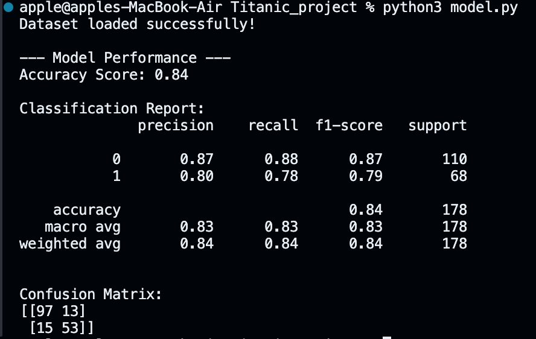

# 🚢 Titanic Survival Prediction

This project is a simple machine learning model that predicts whether a passenger survived the Titanic disaster. It uses the well-known Titanic dataset and focuses on understanding how different features like age, gender, and ticket class affected survival chances.

---

## ⚫ Overview

The goal of this project was to go through the complete machine learning workflow:

- Data cleaning and preprocessing  
- Handling missing values  
- Encoding categorical features  
- Training a classification model  
- Evaluating model performance  

---

## ⚫ Features Used

The model uses the following features:

- `Pclass` – Passenger class  
- `Sex` – Gender  
- `Age` – Age of the passenger  
- `Fare` – Ticket fare  
- `SibSp` – Number of siblings/spouses aboard  
- `Parch` – Number of parents/children aboard  

---

## ⚫ Tech Stack

- Python  
- Pandas  
- NumPy  
- Scikit-learn  
- Matplotlib / Seaborn  

---


## ⚫ How to Run

1. Clone the repository:

```bash
git clone https://github.com/hassanakhlaqi/Titanic-Survival-prediction.git
```

2. Navigate to the project folder:

```bash
cd Titanic-Survival-prediction
```

3. Install dependencies:

```bash
pip install -r requirements.txt
```

4. Run the project:

```bash
python main.py
```

---

## 📊 Model Performance

The model achieves around **70–80% accuracy**, depending on preprocessing.  
This project focuses more on understanding the pipeline rather than maximizing performance.

---

## 📁 Project Structure

```text
Titanic-Survival-prediction/
│
├── data/
├── model.py
├── requirements.txt
├── titanic-dataset-prediction.ipynb
├── titanic.csv
├── titanic1.png
├── titanic2.png
└── README.md
```

## 📊 predicted output




---

## 📝 Notes

- This is a beginner-friendly project focused on fundamentals  
- There is room for improvement (feature engineering, hyperparameter tuning, trying other models)

---

## ⚫ Final Thoughts

Built this project to get hands-on experience with machine learning basics and model building.  
Feel free to fork the repo or suggest improvements.
